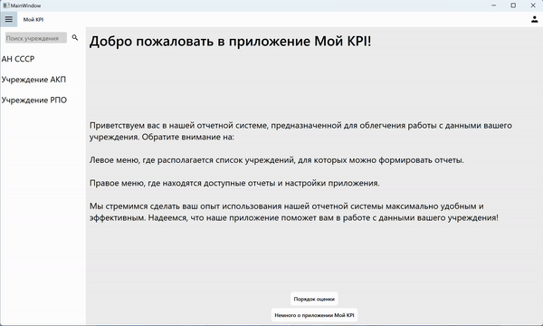

# My KPI

Это приложение на Qt C++, предназначенное для облегчения процесса ввода и анализа ключевых показателей эффективности (KPI) сотрудников.

## Основные функции

- **Интуитивно-понятный интерфейс**: Простота и удобство использования на первом месте. Я упростил процесс заполнения и анализа KPI до минимума, делая его понятным даже для новых пользователей.

- **Ввод числовых показателей**: Предоставляю удобные поля для ввода всех необходимых числовых данных, которые требуются для расчета ключевых показателей.

- **Автоматический расчет балла**: После ввода данных приложение автоматически производит расчет сформированного балла, основываясь на предоставленных показателях.

- **Экспорт данных в CSV**: Экспортируйте собранные данные в формате CSV для последующего анализа, отправке по почте или использования в других системах.

## Диаграмма вариантов использования

## Установка и запуск

1. **Скачайте** последнюю версию архива приложения `.zip` из раздела [релизов](https://github.com/estle/My-KPI/releases).
2. **Разархивируйте** папку.
3. **Запустите** приложение KPI.exe и начните использовать его!

## Планы по развитию

Приложение разработано с учетом возможностей для будущего расширения функционала. Мы планируем добавить новые полезные функции и улучшить существующие, чтобы соответствовать вашим потребностям еще лучше.
